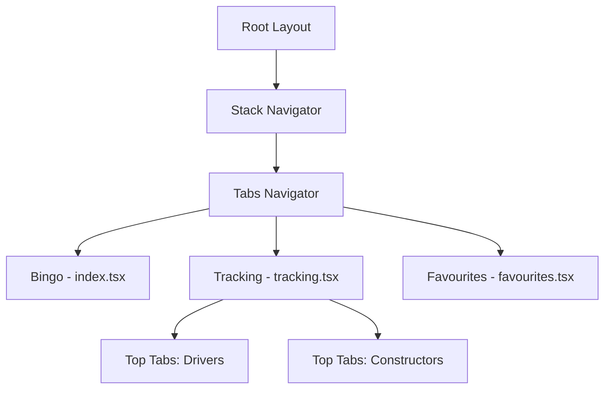

Season Journal uses [Expo Router](https://docs.expo.dev/router/introduction/) for type-safe, file-based navigation. The routing structure is intuitive, with the file system directly mapping to navigation screens.

## Routing Architecture

Expo Router automatically generates routes based on the `app/` directory structure:

```text
app/
├── _layout.tsx           # Root layout (Stack navigator)
└── (tabs)/               # Tab group (Bottom tab navigator)
    ├── _layout.tsx       # Tab navigator configuration
    ├── index.tsx         # / (Bingo)
    ├── tracking.tsx      # /tracking
    └── favourites.tsx    # /favourites
```

<Note>
The `(tabs)` folder uses parentheses to create a route group. Groups organize routes without affecting the URL path.
</Note>

## Root Layout

The root layout in `app/_layout.tsx` provides the app-wide context and navigation structure:

```tsx app/_layout.tsx
import "../global.css";
import { QueryClientProvider } from "@tanstack/react-query";
import { Stack } from "expo-router";
import { StatusBar } from "expo-status-bar";
import { Colors } from "@/constants/theme";
import { queryClient } from "@/lib/api/query-client";

export const unstable_settings = {
  anchor: "(tabs)",  // Set initial route to tabs
};

export default function RootLayout() {
  const [fontsLoaded] = useFonts({
    Inter_400Regular,
    Inter_500Medium,
    Inter_600SemiBold,
    Inter_700Bold,
    Nunito_400Regular,
    Nunito_500Medium,
    Nunito_600SemiBold,
    Nunito_700Bold,
  });

  useEffect(() => {
    if (fontsLoaded) {
      SplashScreen.hideAsync();
    }
  }, [fontsLoaded]);

  if (!fontsLoaded) {
    return null;
  }

  return (
    <QueryClientProvider client={queryClient}>
      <Stack
        screenOptions={{
          headerShown: false,
          contentStyle: { backgroundColor: Colors.background },
        }}
      >
        <Stack.Screen name="(tabs)" />
      </Stack>
      <StatusBar style="dark" />
    </QueryClientProvider>
  );
}
```

**Key features:**
- Wraps the app in `QueryClientProvider` for React Query
- Loads custom fonts before rendering
- Sets global background color
- Configures Stack navigator with hidden headers

## Bottom Tab Navigation

The bottom tabs are configured in `app/(tabs)/_layout.tsx`:

```tsx app/(tabs)/_layout.tsx
import { Tabs } from "expo-router";
import { Grid3X3, Heart, TrendingUp } from "lucide-react-native";
import { useCallback } from "react";
import GlassyTabBar from "@/components/journal-tab-bar";

export default function TabLayout() {
  const renderTabBar = useCallback(
    (props: React.ComponentProps<typeof GlassyTabBar>) => (
      <GlassyTabBar {...props} />
    ),
    []
  );

  return (
    <Tabs
      tabBar={renderTabBar}  // Custom tab bar component
      screenOptions={{
        headerShown: false,
      }}
    >
      <Tabs.Screen
        name="index"
        options={{
          title: "Bingo",
          tabBarIcon: ({ color, size }) => (
            <Grid3X3 color={color} size={size} strokeWidth={1.25} />
          ),
        }}
      />
      <Tabs.Screen
        name="tracking"
        options={{
          title: "Tracking",
          tabBarIcon: ({ color, size }) => (
            <TrendingUp color={color} size={size} strokeWidth={1.25} />
          ),
        }}
      />
      <Tabs.Screen
        name="favourites"
        options={{
          title: "Favourites",
          tabBarIcon: ({ color, size }) => (
            <Heart color={color} size={size} strokeWidth={1.25} />
          ),
        }}
      />
    </Tabs>
  );
}
```

### Tab Screens

<CardGroup cols={3}>
  <Card icon="grid-2-plus" title="Bingo">
    **Route:** `/`
    
    **File:** `index.tsx`
    
    Interactive race prediction bingo grid
  </Card>
  
  <Card icon="chart-line" title="Tracking">
    **Route:** `/tracking`
    
    **File:** `tracking.tsx`
    
    Championship standings (Drivers & Constructors)
  </Card>
  
  <Card icon="heart" title="Favourites">
    **Route:** `/favourites`
    
    **File:** `favourites.tsx`
    
    Saved drivers and teams
  </Card>
</CardGroup>

### Custom Tab Bar

Season Journal uses a custom glassmorphic tab bar component (`GlassyTabBar`) for a modern, polished look. The custom tab bar is passed via the `tabBar` prop.

## Nested Navigation: Material Top Tabs

The Tracking screen uses Material Top Tabs for nested navigation between Drivers and Constructors:

```tsx app/(tabs)/tracking.tsx
import { createMaterialTopTabNavigator } from "@react-navigation/material-top-tabs";
import { View } from "react-native";
import { useSafeAreaInsets } from "react-native-safe-area-context";
import ConstructorsScreen from "@/components/screens/constructors-screen";
import DriversScreen from "@/components/screens/drivers-screen";
import { Colors, Fonts } from "@/constants/theme";

const TopTabs = createMaterialTopTabNavigator();

export default function TrackingScreen() {
  const insets = useSafeAreaInsets();

  return (
    <View style={{ flex: 1, backgroundColor: Colors.background }}>
      {/* Safe area spacer */}
      <View
        style={{
          paddingTop: insets.top + 16,
          paddingHorizontal: 20,
          paddingBottom: 12,
          backgroundColor: Colors.background,
        }}
      />
      
      <TopTabs.Navigator
        screenOptions={{
          tabBarStyle: {
            backgroundColor: Colors.surfaceSolid,
            marginHorizontal: 20,
            borderRadius: 24,
            elevation: 0,
            shadowColor: "#000",
            shadowOffset: { width: 0, height: 2 },
            shadowOpacity: 0.04,
            shadowRadius: 8,
            height: 48,
            overflow: "hidden",
          },
          tabBarIndicatorStyle: {
            backgroundColor: Colors.accent,
            height: 40,
            borderRadius: 20,
            top: 4,
          },
          tabBarIndicatorContainerStyle: {
            paddingHorizontal: 6,
          },
          tabBarLabelStyle: {
            fontFamily: Fonts.bodyBold,
            fontSize: 14,
            textTransform: "none",
          },
          tabBarActiveTintColor: Colors.textPrimary,
          tabBarInactiveTintColor: Colors.textSecondary,
          tabBarPressColor: "transparent",
        }}
      >
        <TopTabs.Screen
          name="Drivers"
          component={DriversScreen}
          options={{ title: "Drivers" }}
        />
        <TopTabs.Screen
          name="Constructors"
          component={ConstructorsScreen}
          options={{ title: "Constructors" }}
        />
      </TopTabs.Navigator>
    </View>
  );
}
```

**Styling highlights:**
- Glassmorphic tab bar with rounded corners
- Custom pill-shaped indicator with accent color
- Bold font for active tabs
- Smooth animations with transparent press color

<Tip>
Material Top Tabs are great for swipeable content within a single screen. They provide a native feel on both iOS and Android.
</Tip>

## Navigation Patterns

### Accessing the Router

Expo Router provides hooks for programmatic navigation:

```tsx
import { useRouter } from "expo-router";

export default function Example() {
  const router = useRouter();

  const goToTracking = () => {
    router.push("/tracking");
  };

  const goBack = () => {
    router.back();
  };

  return (
    <>
      <Button title="View Standings" onPress={goToTracking} />
      <Button title="Back" onPress={goBack} />
    </>
  );
}
```

### Navigation Methods

<ParamField path="router.push" type="function">
  Navigate to a new route and add it to the history stack.
  
  ```tsx
  router.push("/tracking");
  ```
</ParamField>

<ParamField path="router.replace" type="function">
  Replace the current route without adding to the history stack.
  
  ```tsx
  router.replace("/favourites");
  ```
</ParamField>

<ParamField path="router.back" type="function">
  Navigate back to the previous screen.
  
  ```tsx
  router.back();
  ```
</ParamField>

<ParamField path="router.canGoBack" type="function">
  Check if there is a screen to go back to.
  
  ```tsx
  if (router.canGoBack()) {
    router.back();
  }
  ```
</ParamField>

### Route Parameters

Pass data between screens using route parameters:

```tsx
// Navigate with params
router.push({
  pathname: "/driver/[id]",
  params: { id: "verstappen" },
});

// Access params in the destination screen
import { useLocalSearchParams } from "expo-router";

export default function DriverScreen() {
  const { id } = useLocalSearchParams();
  // id === "verstappen"
}
```

## Type-Safe Navigation

Expo Router automatically generates TypeScript types for routes:

```typescript
import { Href } from "expo-router";

const route: Href = "/tracking";  // Type-safe route string
router.push(route);
```

<Warning>
Typo in route strings will cause TypeScript errors, preventing runtime navigation bugs.
</Warning>

## Screen Options

Customize screen appearance with options:

```tsx
<Tabs.Screen
  name="tracking"
  options={{
    title: "Tracking",
    headerShown: false,
    tabBarIcon: ({ color, size }) => (
      <TrendingUp color={color} size={size} />
    ),
    tabBarBadge: 3,  // Show badge
  }}
/>
```

## Navigation Flow



## Best Practices

<Steps>
  <Step title="Use file-based routing">
    Let the file system define your routes. Avoid manual route configuration.
  </Step>
  
  <Step title="Leverage route groups">
    Use `(groupName)` to organize routes without affecting URLs.
  </Step>
  
  <Step title="Type-safe navigation">
    Use TypeScript and Expo Router's generated types to prevent navigation errors.
  </Step>
  
  <Step title="Custom navigators for special UIs">
    Use Material Top Tabs, Drawers, or custom navigators when the UX requires it.
  </Step>
  
  <Step title="Handle safe areas">
    Use `useSafeAreaInsets` to ensure content doesn't overlap with system UI.
  </Step>
</Steps>

## Useful Hooks

<CardGroup cols={2}>
  <Card title="useRouter" icon="route">
    Access navigation methods (`push`, `back`, `replace`)
  </Card>
  
  <Card title="useLocalSearchParams" icon="magnifying-glass">
    Access route parameters in the current screen
  </Card>
  
  <Card title="useSegments" icon="list">
    Get the current route segments as an array
  </Card>
  
  <Card title="usePathname" icon="link">
    Get the current pathname string
  </Card>
</CardGroup>

## Next Steps

<CardGroup cols={2}>
  <Card title="Project Structure" icon="folder-tree" href="/development/project-structure">
    Understand the overall codebase organization
  </Card>
  
  <Card title="Components" icon="cube" href="/components/overview">
    Explore available UI components
  </Card>
</CardGroup>